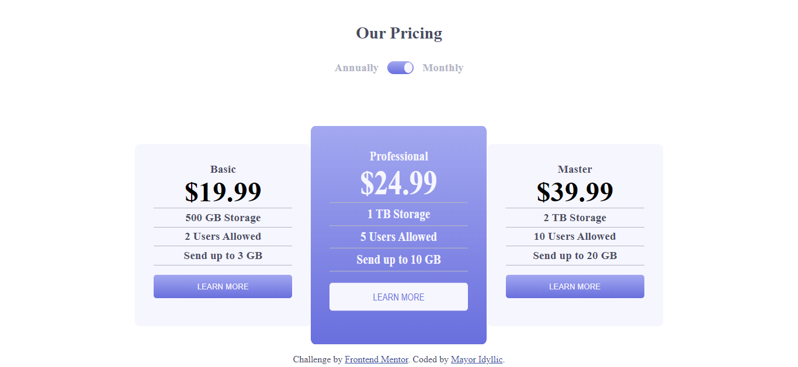
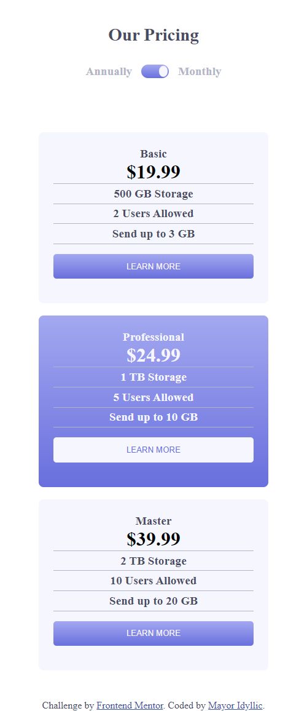

# Frontend Mentor - Pricing component with toggle solution

This is a solution to the [Pricing component with toggle challenge on Frontend Mentor](https://www.frontendmentor.io/challenges/pricing-component-with-toggle-8vPwRMIC). Frontend Mentor challenges help you improve your coding skills by building realistic projects. 

## Table of contents

- [Overview](#overview)
  - [The challenge](#the-challenge)
  - [Screenshot](#screenshot)
  - [Links](#links)
- [My process](#my-process)
  - [Built with](#built-with)
- [Author](#author)

**Note: Delete this note and update the table of contents based on what sections you keep.**

## Overview

### The challenge

Users should be able to:

- View the optimal layout for the component depending on their device's screen size
- Control the toggle with both their mouse/trackpad and their keyboard

### Screenshot

### Links

- Solution URL: [https://github.com/Mayor-Isaac/pricing-component.git)]
- Live Site URL: [https://idyllic-pricing-component.netlify.app/]

## My process

### Built with

- Semantic HTML5 markup
- CSS custom properties
- Flexbox
- CSS Grid
- Mobile-first workflow
-JavaScript

## Author

- LinkedIn - [Feranmi Ogunyileka](https://www.linkedin.com/in/feranmi-ogunyileka-359a1723b)
- Frontend Mentor - [@Mayor-Isaac](https://www.frontendmentor.io/profile/Mayor-Isaac)
- Twitter - [@mayor_idyllic](https://www.twitter.com/mayor_idyllic)
